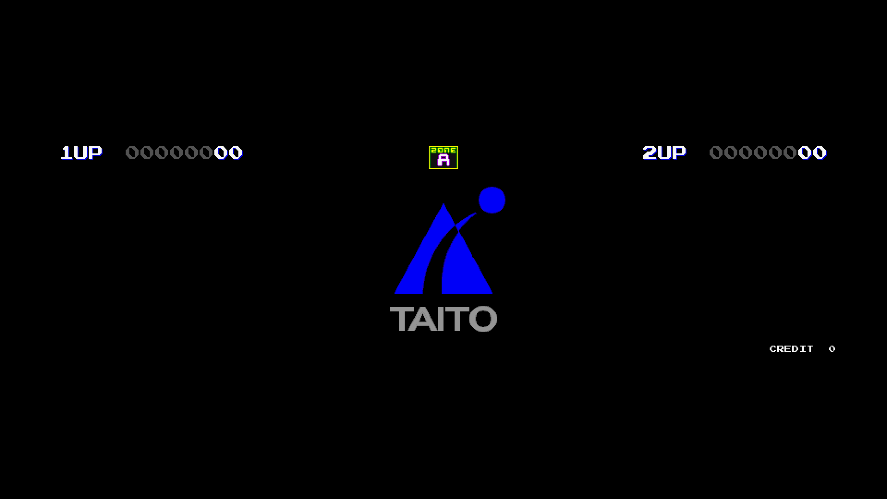
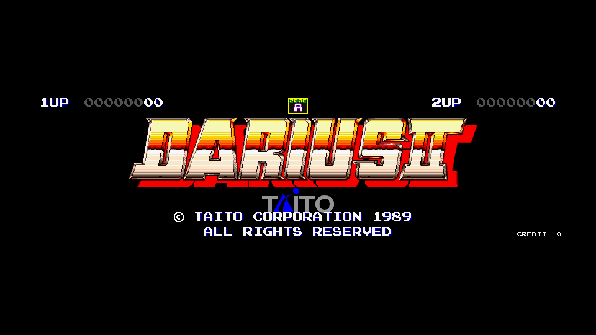
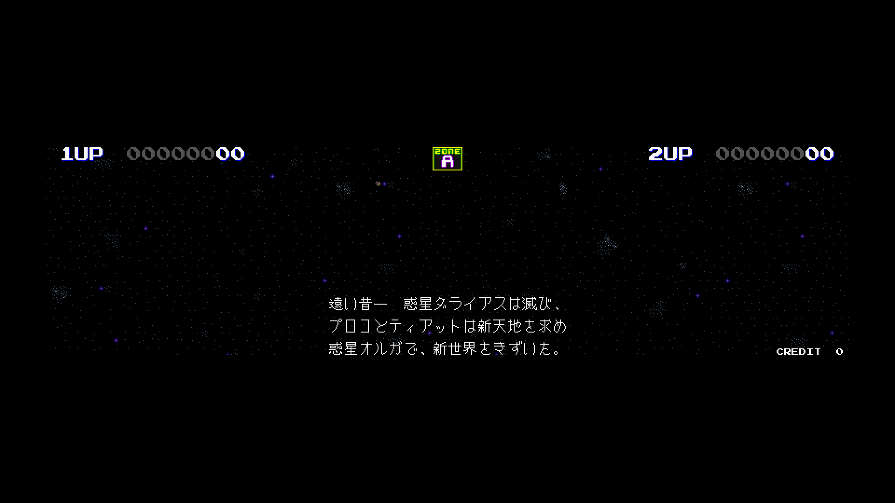
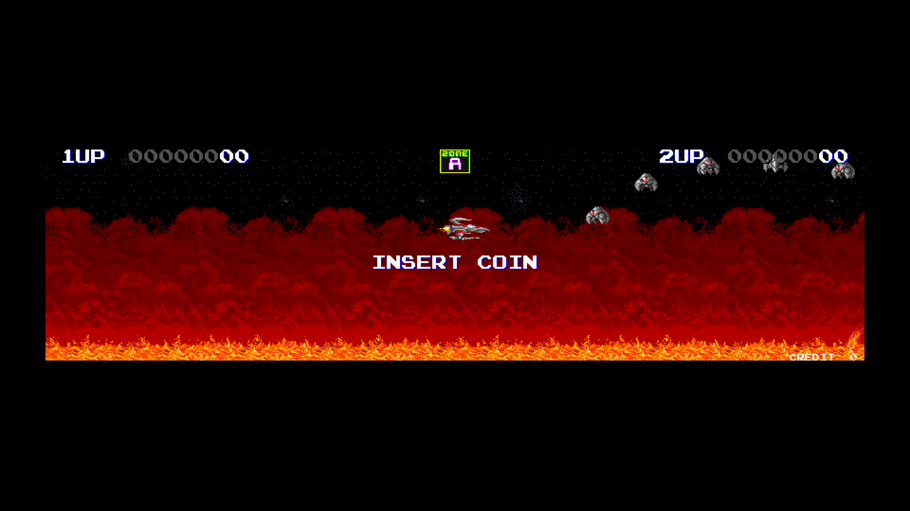
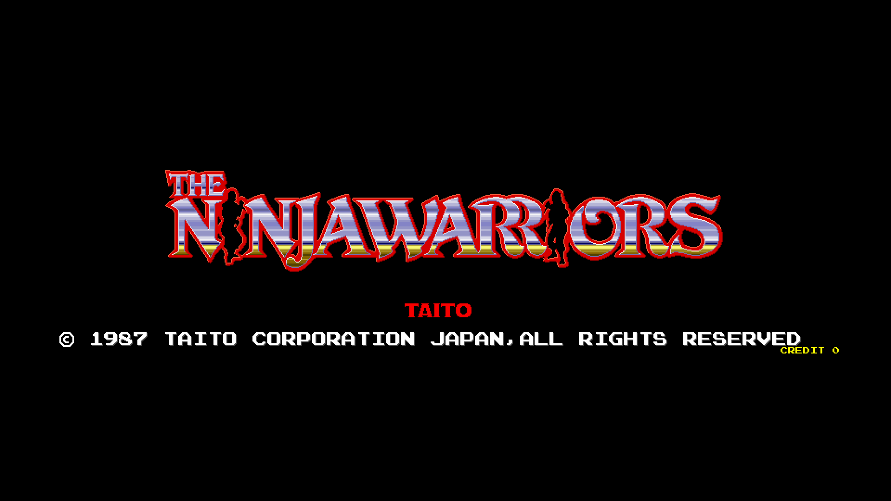
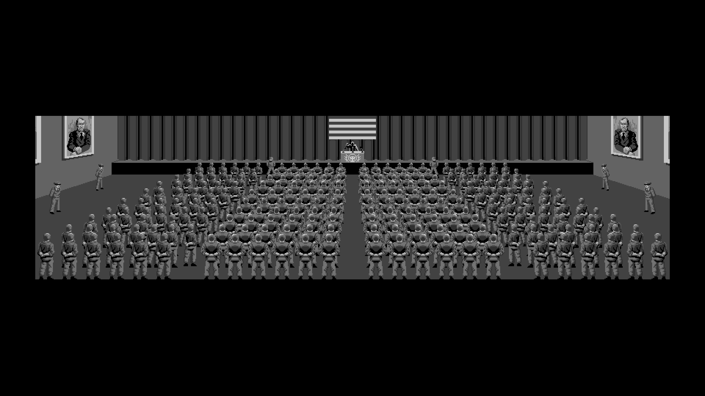
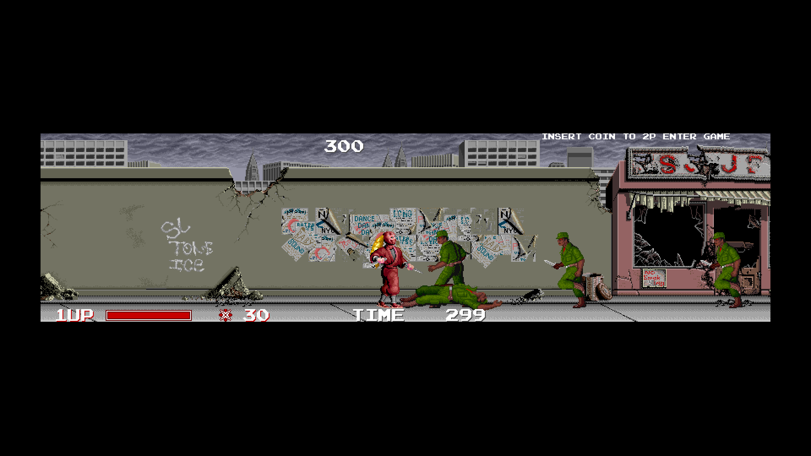
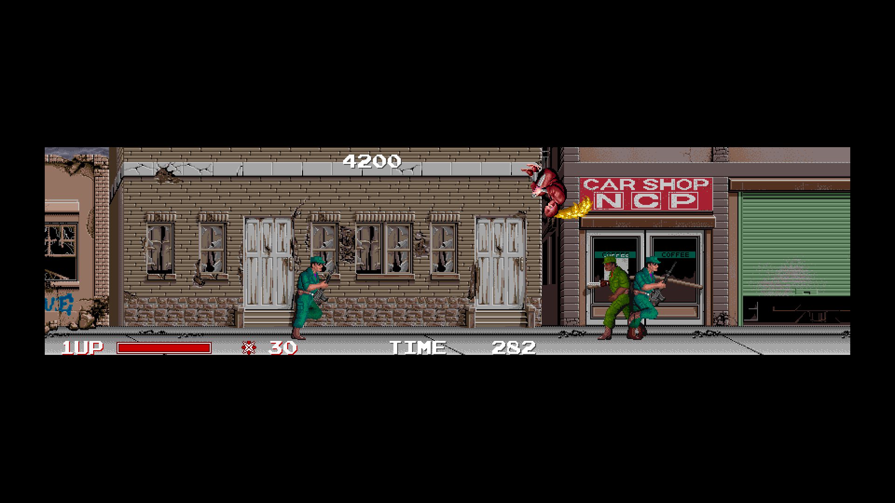

# Arcade-Darius2NinjaWarriors_MiSTer

FPGA core for **Darius II** (Taito Corporation, 1989) and **The Ninja Warriors**
(Taito Corporation, 1987) targeting the
[MiSTer FPGA](https://github.com/MiSTer-devel) platform (Terasic DE10-Nano).

Both games run on the **Taito ninjaw board** — a triple-screen horizontal
arcade hardware with dual 68000 CPUs, Z80 sound CPU, three TC0100SCN
tilemap chips (one per panel), TC0110PCR palette × 3, custom sprite
generator with 16×16 4bpp tiles, TC0140SYT main↔sound communication,
and YM2610 (FM + SSG + ADPCM-A + ADPCM-B) audio.

This core reimplements the hardware in SystemVerilog from MAME references
and hardware observation.

## Status

**Current version: 1.0** (May 2026)

The core runs both games end-to-end and has been tested on real MiSTer
hardware.

**Features**
- Dual 68000 main/sub with shared RAM and dual-port sprite RAM (FX68K core)
- Three horizontal panels composed into the 864-pixel virtual screen
- Three TC0100SCN tilemap chips (BG0 + BG1 + FG0 per panel) — MAME-accurate
- Three TC0110PCR palette chips per panel
- Sprite renderer with priority, flip, 16×16 4bpp tiles, MAME 1:1 wrap math
- Audio: YM2610 (FM + SSG + ADPCM-A + ADPCM-B) via JT10
- TC0140SYT main↔Z80 sound communication
- TC0220IOC inputs + DIP switches
- Sprite ROM cache backed by DDR3
- Tile ROM streaming through SDRAM round-robin arbiter
- Pause overlay with project logo, scrolling supporters list (tier colors:
  Bronze / Silver / Gold), and social links
- "Clean Pause" OSD option to bypass the overlay
- VBlank-synchronized pause (frame-aligned, no race conditions)
- MiSTer OSD with video, pause and DIP options

**ROM sets supported (parents)**
- Darius II (Japan, rev 1)
- The Ninja Warriors (World)

## Screenshots

### Darius II

| | |
|---|---|
|  |  |
| Boot — Taito logo | Title screen |
|  |  |
| Intro narration | Attract — "INSERT COIN" |

### The Ninja Warriors

| | |
|---|---|
|  |  |
| Title screen | Intro — propaganda hall |
|  |  |
| Stage 1 — street | Stage 1 — car shop |

## Notes

- 15 kHz CRT output is **not currently supported** (non-standard 864×224
  triple-panel resolution incompatible with the analog I/O board)
- For HDMI use the HDMI output directly. For 31 kHz VGA monitors use an
  HDMI→VGA adapter — do **not** enable Direct Video

## Hardware requirements

- Terasic DE10-Nano
- MiSTer I/O board (recommended)
- SDRAM module (32 MB or 64 MB)
- DDR3 memory (built into DE10-Nano, used for sprite ROM cache)
- HDMI display (recommended), or HDMI→VGA adapter for 31 kHz VGA monitors

## Build from source

Requires **Quartus Prime Lite 17.0.x** for Cyclone V (5CSEBA6U23I7).

```bash
cd Arcade-Darius2NinjaWarriors_MiSTer
quartus_sh --flow compile Darius2NinjaWarriors -c Darius2NinjaWarriors
```

Output: `output_files/Darius2NinjaWarriors.rbf` (~4.1 MB).

## Running on MiSTer

The [releases/](releases/) folder contains the pre-built bitstream and
the parent MRA files for both games:

- `Darius2NinjaWarriors_YYYYMMDD.rbf` — pre-built core bitstream
- `Darius II (Japan, rev 1).mra` — Darius II parent MRA
- `The Ninja Warriors (World).mra` — Ninja Warriors parent MRA

Alternative ROM sets for Ninja Warriors are provided in
[releases/alternatives/](releases/alternatives/):

- `The Ninja Warriors (World, earlier version).mra` — ninjaw1
- `The Ninja Warriors (Japan).mra` — ninjawj
- `The Ninja Warriors (US, Romstar license).mra` — ninjawu

Steps:

1. Copy the `.rbf` to `_Arcade/cores/` on the MiSTer SD card.
2. Copy the desired `.mra` file(s) to `_Arcade/` on the MiSTer SD card.
3. Provide your legally-owned ROM files where each MRA expects them
   (usually in `games/mame/`).
4. For HDMI displays, no special setup is required. For 31 kHz VGA
   monitors, use an HDMI→VGA adapter (do **not** enable Direct Video).
   15 kHz CRT output is not currently supported (see Hardware requirements).

**ROMs are NOT included in this repository.** You must provide them yourself.

## Repository layout

```
Arcade-Darius2NinjaWarriors_MiSTer/
├── rtl/
│   ├── darius2/      Darius II / Ninja Warriors core RTL (Umberto Parisi)
│   ├── fx68k/        M68000 core (Jorge Cwik)
│   ├── jt12/         YM2610 FM synth (Jose Tejada)
│   ├── jt5205/       MSM5205 ADPCM (Jose Tejada)
│   ├── jtframe/      JTFRAME framework modules (Jose Tejada)
│   ├── t80/          Z80 core (Daniel Wallner, MikeJ)
│   ├── pll/          Clock PLL (Altera/Quartus megafunction)
│   └── sdram.sv      SDRAM controller (Sorgelig)
├── sys/              MiSTer framework (Sorgelig / MiSTer-devel)
├── logo/             Pause overlay assets (logo, font, supporter scroll)
├── docs/             Screenshots
├── releases/         Pre-built .rbf + parent MRA files (both games)
│   └── alternatives/ MRA files for alternate ROM sets (Ninja Warriors variants)
├── Darius2NinjaWarriors.qpf  Quartus project
├── Darius2NinjaWarriors.qsf  Quartus assignments
├── Template.sv       Top-level wrapper
├── Template.sdc      Timing constraints
├── files.qip         HDL file list
├── build_id.v        Build version stamp
├── LICENSE           GNU GPL v3
├── AUTHORS.md        Credits and third-party licenses
└── README.md         This file
```

## License

Distributed under **GNU General Public License v3 or later**.
See [LICENSE](LICENSE) and [AUTHORS.md](AUTHORS.md) for credits and
third-party licensing.

GPL-3 is chosen to stay compatible with upstream GPL-3 dependencies
(JTFRAME, FX68K, Sorgelig's sdram and sys framework).

## Support this project

If you enjoy this core and want to support its development:

- [Ko-fi](https://ko-fi.com/ibecerivideoludici) — one-time support
- [Patreon](https://www.patreon.com/IBeceriVideoludici) — monthly support
- [PayPal](https://www.paypal.me/IBeceriVideoludici) — one-time donation

## Follow

- [Twitch](https://twitch.tv/ibecerivideoludici) — live streams
- [YouTube](https://www.youtube.com/c/IBeceriVideoludici/playlists) — playlists and videos

## Credits

Built on top of work by:

- **Jorge Cwik** — [FX68K](https://github.com/ijor/fx68k) (M68000 core)
- **Jose Tejada** / Jotego — [JTFRAME, JT12 (JT10 YM2610), JT5205](https://github.com/jotego/jtcores)
- **Martin Donlon** (wickerwaka) — [TC0110PR / TC0140SYT modules](https://github.com/wickerwaka/Arcade-TaitoF2_MiSTer)
- **Sorgelig** and the **MiSTer-devel team** — framework, SDRAM controller, T80
- The **MAME** project — invaluable hardware reference (TC0100SCN, memory maps, timing)

Full list in [AUTHORS.md](AUTHORS.md).

Original Darius II and The Ninja Warriors arcade hardware © Taito Corporation, 1989 / 1987.
